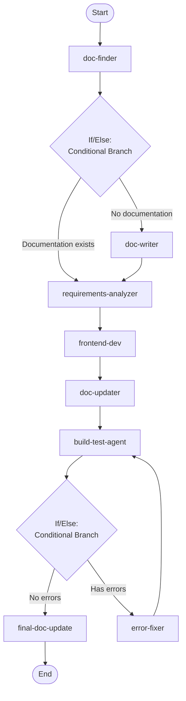

## Workflow Execution Guide

Follow the Mermaid flowchart above to execute the workflow. Each node type has specific execution methods as described below.

### Execution Methods by Node Type

- **Rectangle nodes**: Execute Sub-Agents using the Task tool
- **Diamond nodes (AskUserQuestion:...)**: Use the AskUserQuestion tool to prompt the user and branch based on their response
- **Diamond nodes (Branch/Switch:...)**: Automatically branch based on the results of previous processing (see details section)
- **Rectangle nodes (Prompt nodes)**: Execute the prompts described in the details section below

### If/Else Node Details

#### doc_check(Binary Branch (True/False))

**Evaluation Target**: Documentation search result

**Branch conditions:**
- **Documentation exists**: Relevant documentation was found
- **No documentation**: No relevant documentation found

**Execution method**: Evaluate the results of the previous processing and automatically select the appropriate branch based on the conditions above.

#### error_check(Binary Branch (True/False))

**Evaluation Target**: Build and test results

**Branch conditions:**
- **No errors**: Build successful, all tests passed, no console errors
- **Has errors**: Build failed, tests failed, or console errors detected

**Execution method**: Evaluate the results of the previous processing and automatically select the appropriate branch based on the conditions above.
