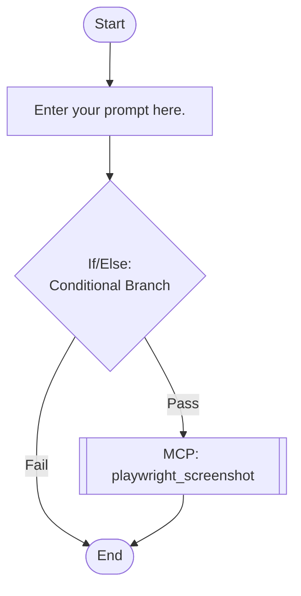

## Workflow Execution Guide

Follow the Mermaid flowchart above to execute the workflow. Each node type has specific execution methods as described below.

### Execution Methods by Node Type

- **Rectangle nodes**: Execute Sub-Agents using the Task tool
- **Diamond nodes (AskUserQuestion:...)**: Use the AskUserQuestion tool to prompt the user and branch based on their response
- **Diamond nodes (Branch/Switch:...)**: Automatically branch based on the results of previous processing (see details section)
- **Rectangle nodes (Prompt nodes)**: Execute the prompts described in the details section below

## MCP Tool Nodes

#### mcp_screenshot(playwright_screenshot)

**Description**: Take a screenshot and save it

**MCP Server**: playwright

**Tool Name**: playwright_screenshot

**Validation Status**: valid

**Configured Parameters**:

- `name` (string): test-validation-success

**Available Parameters**:

- `name` (string) (required): Screenshot file name

This node invokes an MCP (Model Context Protocol) tool. When executing this workflow, use the configured parameters to call the tool via the MCP server.

### Prompt Node Details

#### prompt_1765268351896(Enter your prompt here.)

```
Enter your prompt here.

You can use variables like {{variableName}}.
```

### If/Else Node Details

#### ifelse_test_validation(Binary Branch (True/False))

**Evaluation Target**: Test validation result

**Branch conditions:**
- **Pass**: Test passed successfully
- **Fail**: Test failed

**Execution method**: Evaluate the results of the previous processing and automatically select the appropriate branch based on the conditions above.
