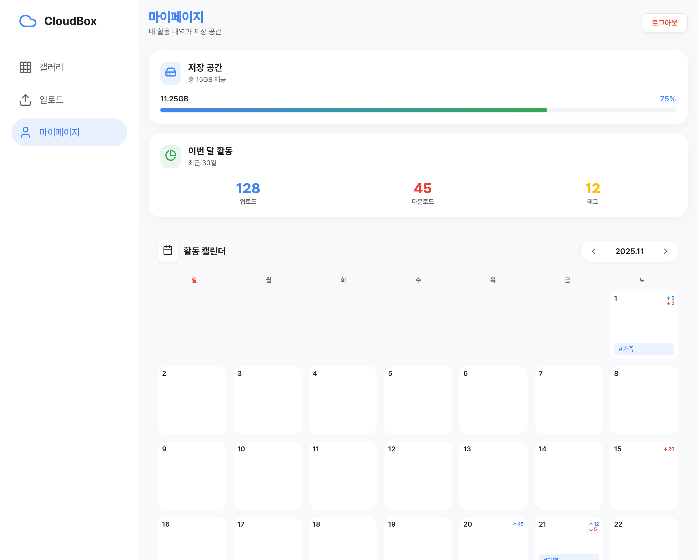

# 🌩️ CloudBox - Modern Cloud Storage PWA

> 구글 스타일의 직관적인 UI를 갖춘 모던 클라우드 스토리지 서비스

[](https://react.dev/)
[](https://vitejs.dev/)
[](https://web.dev/progressive-web-apps/)
[](LICENSE)

웹 기반의 클라우드 저장소 서비스로, **모바일 퍼스트 PWA(Progressive Web App)**로 제작되었습니다.
사진과 동영상을 안전하게 저장하고 관리할 수 있으며, **썸네일 최적화**를 통해 빠른 로딩 속도를 제공합니다.

## ✨ 주요 기능

### 🔐 인증 시스템
- **Google OAuth 2.0** 통합
- JWT 토큰 기반 인증
- 자동 토큰 갱신

### 🖼️ 갤러리
- **날짜별 자동 그룹화** - 업로드 날짜별로 사진/동영상 자동 분류
- **고급 검색** - 파일 이름 검색 및 `#태그` 검색 지원
- **스마트 필터링** - 타입(이미지/비디오), 날짜 범위, 정렬 옵션
- **다중 선택 다운로드** - 최대 30개 파일 일괄 다운로드
- **썸네일 최적화** ⚡ - 200x200px 썸네일로 5-10배 빠른 로딩

### 📤 파일 업로드
- **드래그 앤 드롭** 지원
- **실시간 진행률 표시**
- **자동 썸네일 생성** - 이미지 업로드 시 자동 썸네일 생성 및 업로드
- **배치 업로드** - 최대 30개 파일 동시 업로드
- **태그 시스템** - 업로드 시 `#태그` 추가

### 👤 마이페이지
- **활동 캘린더** 📅 - 날짜별 업로드/다운로드 이력 및 태그 시각화
- **저장 공간 대시보드** - 실시간 용량 사용량 Progress Bar
- **월간 활동 통계** - 업로드/다운로드/태그 통계

### 📱 PWA 기능
- 모바일 홈 화면에 **앱처럼 설치** 가능
- **오프라인 지원** 및 빠른 로딩 속도
- **반응형 레이아웃** (Mobile, Tablet, Desktop)

## 🚀 성능 최적화

### 썸네일 시스템
```
원본 이미지 (2MB) → 썸네일 (20KB)
로딩 속도: 5-10배 향상
데이터 절약: 90% 이상
```

**동작 방식:**
1. 이미지 업로드 시 200x200px JPEG 썸네일 자동 생성 (품질 80%)
2. 원본 + 썸네일 동시 S3 업로드
3. 갤러리에서 썸네일 우선 표시
4. 상세보기/다운로드 시 원본 사용

### 코드 최적화
- `React.memo`를 활용한 불필요한 리렌더링 방지
- `useMemo`, `useCallback`를 통한 연산 최적화
- Lazy Loading으로 이미지 점진적 로딩
- Vite의 코드 스플리팅

## 📸 스크린샷

<table>
  <tr>
    <td align="center">
      <br/>
      <b>🔐 로그인 페이지</b><br/>
      <sub>Google OAuth 통합</sub>
    </td>
    <td align="center">
      <br/>
      <b>🖼️ 갤러리</b><br/>
      <sub>날짜별 그룹화 & 검색</sub>
    </td>
    <td align="center">
      <br/>
      <b>📊 마이페이지</b><br/>
      <sub>활동 캘린더 & 통계</sub>
    </td>
  </tr>
</table>

## 🛠️ 기술 스택

### Frontend
- **Framework:** React 19
- **Build Tool:** Vite 7
- **Language:** JavaScript (ES6+)
- **Styling:** Vanilla CSS (CSS Variables, Flexbox/Grid)
- **Icons:** Lucide React
- **Date Utils:** date-fns
- **PWA:** vite-plugin-pwa

### Backend Integration
- **Storage:** AWS S3 (Presigned URLs)
- **API:** RESTful API with JWT Auth
- **Image Processing:** Canvas API (썸네일 생성)

### DevOps
- **Hosting:** AWS S3 + CloudFront
- **CI/CD:** GitHub Actions
- **Monitoring:** Console Performance API

## 📁 프로젝트 구조

```
cloud_repository/
├── src/
│   ├── api/           # API 클라이언트
│   │   ├── client.js  # Axios 인스턴스
│   │   └── fileApi.js # 파일 업로드/다운로드 API
│   ├── components/    # 재사용 컴포넌트
│   │   ├── FileUpload.jsx
│   │   ├── Layout.jsx
│   │   └── ProtectedRoute.jsx
│   ├── pages/         # 페이지 컴포넌트
│   │   ├── Login.jsx
│   │   ├── Gallery.jsx
│   │   └── MyPage.jsx
│   ├── utils/         # 유틸리티 함수
│   │   ├── auth.js
│   │   └── thumbnail.js  # 썸네일 생성
│   ├── data/          # Mock 데이터
│   └── main.jsx       # 진입점
├── public/            # 정적 파일
├── screenshots/       # README 스크린샷
└── vite.config.js     # Vite 설정
```

## 🚀 시작하기

### 필수 요구사항
- Node.js 18+
- npm 또는 yarn

### 설치

```bash
# 저장소 클론
git clone https://github.com/JokerTrickster/cloud_repository.git
cd cloud_repository

# 의존성 설치
npm install
```

### 환경 변수 설정

`.env` 파일 생성:

```env
# Auth API (포트 18081)
VITE_AUTH_API_URL=http://localhost:18081

# File API (포트 18080)
VITE_FILE_API_URL=http://localhost:18080

# Google OAuth
VITE_GOOGLE_CLIENT_ID=your-google-client-id
```

### 개발 서버 실행

```bash
npm run dev
```

브라우저에서 `http://localhost:5173` 접속

### 프로덕션 빌드

```bash
# 빌드
npm run build

# 빌드 결과 미리보기
npm run preview
```

## 🎨 디자인 시스템

### 컬러 팔레트
```css
--primary: #4285F4;      /* Google Blue */
--secondary: #34A853;    /* Google Green */
--accent: #EA4335;       /* Google Red */
--warning: #FBBC04;      /* Google Yellow */
```

### 타이포그래피
- **Font Family:** Inter, -apple-system, system-ui
- **Font Sizes:** 12px ~ 28px (반응형)
- **Font Weights:** 400, 500, 600, 700, 800

### 레이아웃
- **Grid:** 5-column grid (모바일)
- **Spacing:** 4px 기반 (4, 8, 12, 16, 20, 24px)
- **Border Radius:** 4px, 8px, 12px, 16px, 20px, 24px

## 🔄 주요 업데이트

### v1.2.0 (2025-11-26)
- ✨ **썸네일 최적화 시스템** 구현
  - 200x200px JPEG 썸네일 자동 생성
  - 갤러리 로딩 속도 5-10배 향상
  - 데이터 사용량 90% 감소
- 🐛 **마이페이지 달력 표시 수정**
  - `grid-auto-rows` 버그 수정
  - 날짜 셀 정상 표시

### v1.1.0 (2025-11-25)
- 🔐 Google OAuth 설정 업데이트
- 🎨 UI/UX 개선
- 📱 반응형 디자인 개선

## 📊 성능 메트릭

| 항목 | 기존 | 최적화 후 | 개선율 |
|------|------|-----------|--------|
| 갤러리 로딩 속도 | 3-5초 | 0.5-1초 | **5-10배** |
| 이미지 크기 | 2MB | 20KB | **100배** |
| 데이터 사용량 | 100MB | 10MB | **90%↓** |

## 🤝 기여하기

1. Fork the Project
2. Create your Feature Branch (`git checkout -b feature/AmazingFeature`)
3. Commit your Changes (`git commit -m 'Add some AmazingFeature'`)
4. Push to the Branch (`git push origin feature/AmazingFeature`)
5. Open a Pull Request

## 📝 라이선스

이 프로젝트는 MIT 라이선스 하에 있습니다.

## 👨‍💻 개발자

**JokerTrickster**
- GitHub: [@JokerTrickster](https://github.com/JokerTrickster)

## 🙏 감사의 말

- [React](https://react.dev/) - UI 프레임워크
- [Vite](https://vitejs.dev/) - 빌드 도구
- [Lucide](https://lucide.dev/) - 아이콘
- [date-fns](https://date-fns.org/) - 날짜 처리

---

<div align="center">
  <sub>Built with ❤️ by JokerTrickster</sub>
</div>
