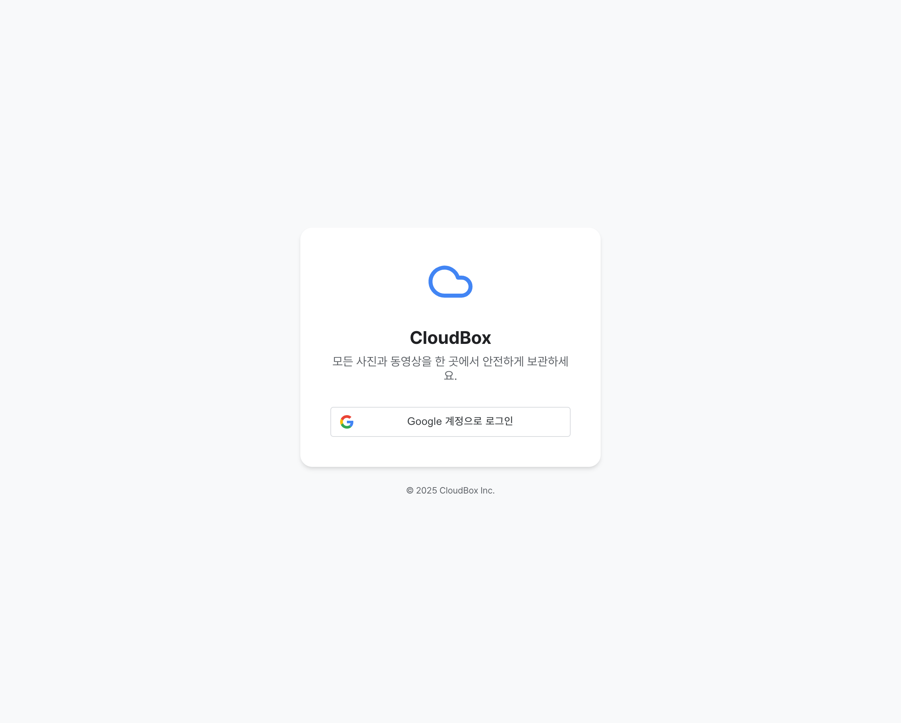
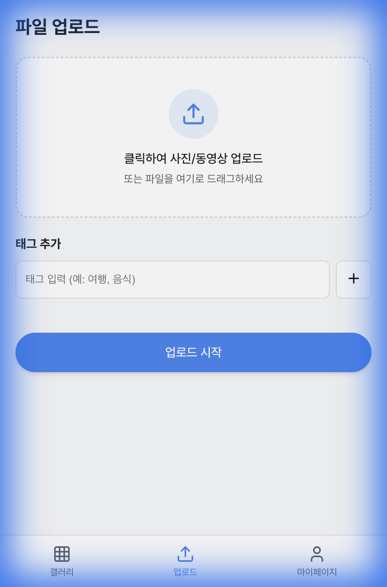
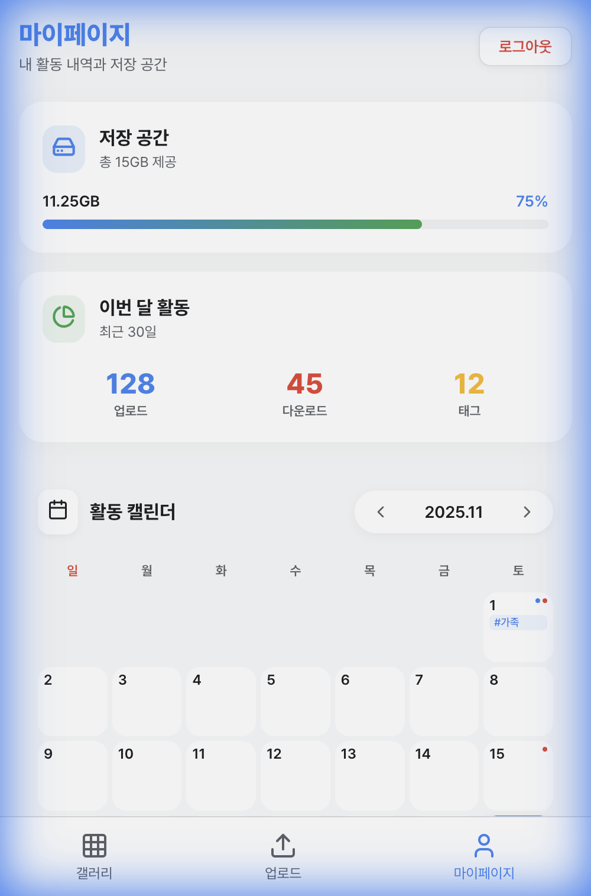
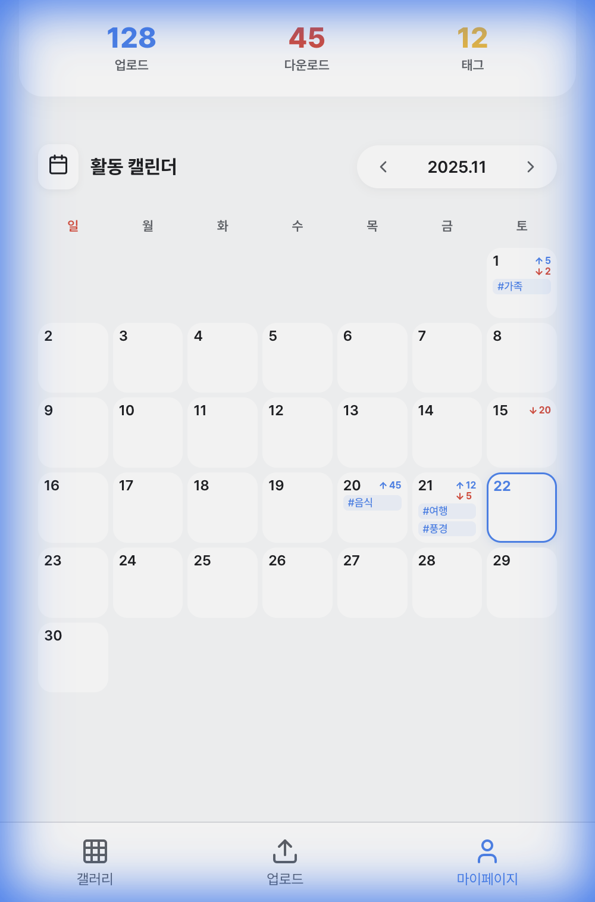

# CloudBox (Cloud Storage PWA)

웹 기반의 클라우드 저장소 서비스로, 모바일 퍼스트 PWA(Progressive Web App)로 제작되었습니다.
구글 스타일의 직관적인 UI를 제공하며, 사진과 동영상을 안전하게 저장하고 관리할 수 있습니다.

**Latest Deployment**: 2025-11-25 (Google OAuth settings updated)

## ✨ 주요 기능

### 1. 🔐 로그인
- 구글 스타일의 심플하고 안전한 로그인 페이지
- 반응형 디자인 지원

### 2. 🖼 갤러리 (Gallery)
- **날짜별 그룹화**: 업로드한 날짜별로 사진/동영상을 자동 분류
- **고급 검색**: 파일 이름 검색 및 `#태그` 검색 지원
- **스마트 필터링**: 날짜순, 이름순, 태그순 정렬
- **보기 설정**: 이미지 그리드 크기 조절 슬라이더
- **다중 다운로드**: 선택 모드를 통해 최대 30개 파일 일괄 다운로드

### 3. 📤 업로드 (Upload)
- **드래그 앤 드롭**: 간편한 파일 추가
- **태그 시스템**: 업로드 시 태그(#여행, #음식 등) 추가 가능
- **용량 제한**: 한 번에 최대 30개 파일까지 업로드 제한

### 4. 👤 마이페이지 (MyPage)
- **활동 캘린더**: 날짜별 업로드/다운로드 이력 및 태그 기록 확인
- **저장 공간**: 실시간 저장 용량 사용량 시각화 (Progress Bar)
- **활동 통계**: 일간/주간/월간 활동 내역 대시보드

### 5. 📱 PWA 지원
- 모바일 홈 화면에 앱처럼 설치 가능
- 오프라인 지원 및 빠른 로딩 속도
- 반응형 레이아웃 (Mobile, Tablet, Desktop)


## 📱 스크린샷

| 로그인 | 갤러리 |
|:---:|:---:|
|  |  |
| **로그인 페이지** | **갤러리 그리드** |

| 업로드 | 마이페이지 |
|:---:|:---:|
|  |  |
| **파일 업로드** | **활동 대시보드** |

| 활동 캘린더 |
|:---:|
|  |
| **월간 활동 이력** |


## 🛠 기술 스택

- **Framework**: React 19, Vite
- **Language**: JavaScript (ES6+)
- **Styling**: Vanilla CSS (CSS Variables, Flexbox/Grid)
- **PWA**: vite-plugin-pwa
- **Icons**: Lucide React
- **Utils**: date-fns (날짜 처리)

## 🚀 실행 방법

### 설치
```bash
npm install
```

### 개발 서버 실행
```bash
npm run dev
```

### 빌드
```bash
npm run build
```

## 🎨 디자인 시스템
- **Primary Color**: Google Blue (#4285F4)
- **Secondary Color**: Google Green (#34A853)
- **Accent Color**: Google Red (#EA4335)
- **Font**: Inter, System Fonts
